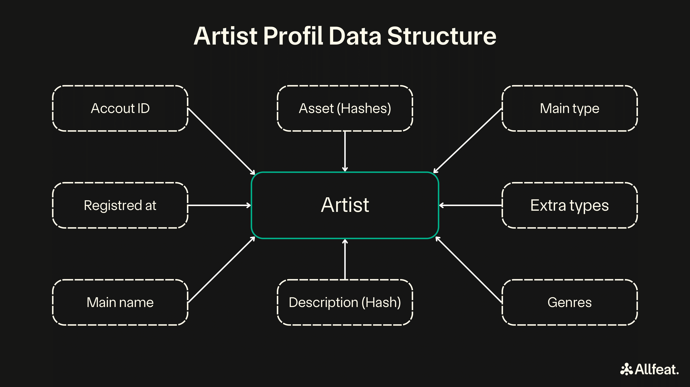

# Artist Profile Registry

## Importance of a Decentralized Artist Profile Registry

As part of the Music Industry Decentralized Data Structure program (MIDDS), the artist profile registry is crucial for ensuring that artist data is managed transparently and securely.

In the current Web2 landscape, artists often need to create separate profiles on each platform they use. This process is not only time-consuming but also inconsistent, as each platform has different data requirements and privacy policies. Additionally, artists have limited control over how their data is stored and managed, leading to potential misuse or loss of data. The lack of transparency in how platforms handle and operate with this data further complicates the situation, eroding trust between artists and service providers.

### Benefits of a Decentralized Registry
1. **Unified Identity**: A decentralized registry ensures that artists maintain a single, consistent profile across all platforms, reducing redundancy and streamlining their online presence.
2. **Data Ownership**: Artists retain control over their own data, with the blockchain providing a secure and tamper-proof record of their profile information.
3. **Transparency**: All changes and accesses to the data are recorded on the blockchain, providing a transparent and verifiable history.
4. **Trust**: Decentralization fosters trust by eliminating the need for a central authority, ensuring that data integrity and authenticity are maintained.

## Artist Profile Data Structure

An artist profile on the blockchain is composed of several key elements that ensure comprehensive and verifiable information is stored. Here is an overview of the data structure used to represent an artist:

### Table Format

| Field              | Description                                    |
|--------------------|------------------------------------------------|
| **Account ID**     | Unique identifier (immutable)                  |
| **Registered At**  | Block number (immutable)                       |
| **Main Name**      | Primary name (immutable)                       |
| **Main Type**      | Primary classification                         |
| **Extra Types**    | Additional classifications                     |
| **Genres**         | Music genres                                   |
| **Description (Hash)** | Digital fingerprint                        |
| **Assets (Hashes)**   | Digital assets                              |

### Visual Representation

Below is a diagram that illustrates the structure of an artist profile on the blockchain:



### Example Profile

Let's assume an artist named "Alice" registers on the Allfeat platform.

- **Account ID**: `0xf24F...` (a unique blockchain account identifier)
- **Registered At**: `123456` (block number at registration)
- **Main Name**: `"Alice"`
- **Main Type**: `Singer`
- **Extra Types**: `[]` (none in this example)
- **Genres**: `[Pop, Indie]`
- **Description (Hash)**: `0xabc123...` (a hash representing the artist's description)
- **Assets (Hashes)**: `[0xdef456..., 0xghi789...]` (hashes of the artist's digital assets)

## Collateral Requirement for Registering an Artist Profile

To register an artist profile on the blockchain, a certain amount of collateral must be deposited. This requirement serves several purposes:

1. **Discouraging Malicious Profiles**: The collateral discourages the creation of fake or malicious profiles by ensuring that there is a cost associated with registration.
2. **Ensuring Quality**: Artists are incentivized to provide accurate and truthful information, knowing that their collateral is at risk if they are found to be in violation of community standards.
3. **Covering Storage Costs**: The collateral is based on a base amount for each registration plus an additional amount determined by the storage size in bytes. This ensures that each additional byte stored is backed by collateral, promoting a healthy and sustainable network.

### Refund and Slashing Mechanisms

- **Voluntary Unregistration**: An artist can voluntarily unregister their profile after a defined period (currently 7 days) from the registration date. Upon unregistration, the collateral is refunded to the artist.
- **Involuntary Removal (Banning)**: If an artist's profile is removed by an external source (usually via a DAO decision), the collateral is slashed and sent to a community treasury. This acts as a penalty for violating community standards and further discourages malicious behavior.

## Technical Implementation

### Rust Structure Explanation

1) **Account ID**

   - **Type**: `AccountId20` (a type alias for the account identifier in the blockchain)  
   - **Description**: The unique identifier of the artist's account on the blockchain. This field is essential for mapping an artist to their blockchain account.
   - **Note**: This field is immutable after registration.

2) **Registered At**

   - **Type**: `BlockNumber` (a type alias for the block number type used in the runtime)
   - **Description**: The block number when the artist was registered on-chain. This provides a timestamp for when the artist's profile was created.
   - **Note**: This field is immutable after registration.

3) **Main Name**

   - **Type**: `BoundedVec<u8, T::MaxNameLen>` (a vector of bytes with a maximum length defined by the runtime parameter `MaxNameLen`)
   - **Description**: The primary name of the artist. This name is immutable after registration to maintain consistency.
   - **Note**: This field is immutable after registration.

4) **Main Type**

   - **Type**: `ArtistType` (an enumeration defining the primary classification of the artist, e.g., singer, disc-jokey)
   - **Description**: Specifies the main type of the artist.

5) **Extra Types**

   - **Type**: `ExtraArtistTypes` (a custom type that can include additional classifications or roles for the artist)
   - **Description**: Allows for specifying secondary types or roles the artist may have.

6) **Genres**

   - **Type**: `BoundedVec<MusicGenre, T::MaxGenres>` (a vector of `MusicGenre` with a maximum length defined by the runtime parameter `MaxGenres`)
   - **Description**: The primary music genres associated with the artist.

7) **Description (Hash)**

   - **Type**: `Option<T::Hash>` (an optional field containing a hash value)
   - **Description**: A digital fingerprint (hash) of the artist's description, ensuring data integrity without storing large text on-chain.

8) **Assets (Hashes)**

   - **Type**: `BoundedVec<T::Hash, T::MaxAssets>` (a vector of hash values with a maximum length defined by the runtime parameter `MaxAssets`)
   - **Description**: Digital fingerprints of the artist's assets such as photos, profile pictures, and videos, which can be used to verify the authenticity of these items.

## Data Size Considerations

Optimizing the storage of data on-chain is crucial for efficiency and scalability. Below are the approximate sizes for each field in the `Artist` structure:

1) **Account ID**

   - **Type**: `AccountId20`
   - **Size**: 20 bytes

2) **Registered At**

   - **Type**: `BlockNumber`
   - **Size**: 4 bytes (a simple `u32`)

3) **Main Name**

   - **Type**: `BoundedVec<u8, T::MaxNameLen>`
   - **Size**: Variable, up to the maximum length defined by `MaxNameLen` (e.g., 50 bytes)

4) **Main Type**

   - **Type**: `ArtistType`
   - **Size**: 1 byte (using a simple enumeration)

5) **Extra Types**

   - **Type**: `ExtraArtistTypes`
   - **Size**: Variable, depending on the implementation of the `ExtraArtistTypes` type

6) **Genres**

   - **Type**: `BoundedVec<MusicGenre, T::MaxGenres>`
   - **Size**: Variable, up to the maximum length defined by `MaxGenres` (e.g., 5 genres, 1 byte each)

7) **Description (Hash)**

   - **Type**: `Option<T::Hash>`
   - **Size**: 32 bytes (if the hash is present, otherwise 1 byte for the `Option` tag)

8) **Assets (Hashes)**

   - **Type**: `BoundedVec<T::Hash, T::MaxAssets>`
   - **Size**: Variable, up to the maximum length defined by `MaxAssets` (e.g., 10 assets, 32 bytes each)

## Interacting with Artist Profiles from Solidity DApps

Developers creating decentralized applications (DApps) using Solidity can interact with the artist profiles on-chain through precompiles. Precompiles act as a bridge between the Substrate pallets and Ethereum Virtual Machine (EVM) contracts, providing a precompiled interface for seamless integration.

### Solidity Data Structure

The data structure for representing an artist profile in Solidity is as follows:

```solidity
struct ArtistData {
    address owner;
    uint32 registered_at;
    ArtistType main_type;
    ArtistType[] extra_types;
    string main_name;
    bytes[] genres;
    DescriptionPreimage description;
    bytes32[] assets;
}

struct Artist {
    bool is_artist;
    ArtistData data;
}
```

### Using Precompiles to Bridge Pallet and EVM

Precompiles allow Solidity contracts to interact with Substrate pallets by providing precompiled interfaces. This enables DApps to access and manage artist profiles stored on-chain through the pallet-artists pallet.

By leveraging precompiles, developers can ensure that their Solidity-based DApps can seamlessly interact with the decentralized artist profile registry on Allfeat, providing a unified and efficient experience for users.

## Source Code

The source code for the pallet-artists can be found in our GitHub repository, providing transparency and opportunities for community contributions:
[Allfeat pallet-artists on GitHub](https://github.com/Allfeat/Allfeat/tree/master/pallets/artists)
